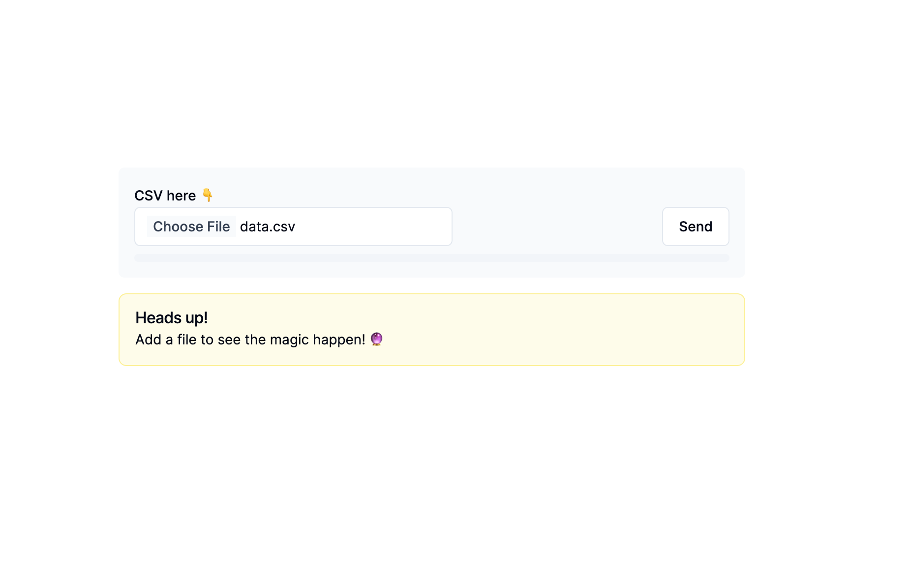
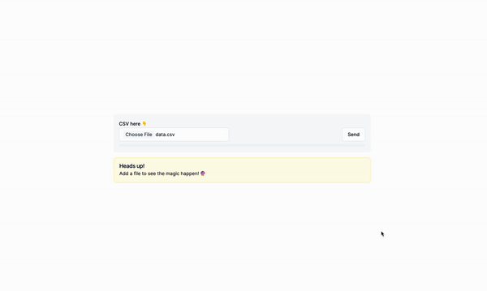

# SSE Client-Server Interaction



This project consists of a client developed in Next.js and a server developed in Nest.js. The purpose of this project is to learn how to interact with Server-Sent Events (SSE).

## Overview

The SSE Client-Server Interaction Project is designed to demonstrate the communication between a client and a server using the SSE protocol. The client is built using Next.js, a popular React framework, while the server is implemented with Nest.js, a progressive Node.js framework.

Server-Sent Events (SSE) is a web technology that enables a unidirectional, long-lived connection between a client and a server. It allows the server to push data to the client over a single HTTP connection, providing real-time updates without the need for continuous client polling.

## Features

- SSE client implemented in Next.js
- SSE server implemented in Nest.js
- Server-side event broadcasting to connected clients
- Client-side event handling and display of real-time updates



1. Progress bar is updated via SSE
2. Table information is filled via SSE, one event per row
3. Toast messages are triggered with SSE

## API Endpoints

The following table describes the API endpoints provided by the server:

| Endpoint          | Method | Description                                                               |
| ----------------- | ------ | ------------------------------------------------------------------------- |
| `/`               | GET    | Returns a greeting message from the server.                               |
| `/sse/:client`    | GET    | Establishes an SSE connection with a specific client.                     |
| `/upload/:client` | POST   | Uploads a file and sends its contents as SSE events to a specific client. |
| `/csv`            | GET    | Generates a CSV file containing mock data.                                |

## Run project

1. Install dependencies on both, server and client with `npm install`
2. Run server with `npm run start:dev`
3. Run client with `npm run dev`
4. Use the file `/server/data.csv`

## Libs

### Frontend

`NextJS` `TailwindCSS` `RadixUI` `ShadcnUI` `hookform` `uuid`

### Backend

`NestJS` `Multer`

## Useful links

- [Using SSE](https://developer.mozilla.org/en-US/docs/Web/API/Server-sent_events/Using_server-sent_events)

- [Distributed SSE](https://www.geekyhacker.com/distributed-sse-with-spring-sseemitter-and-redis-pub-sub/)

- [Polyfill](https://github.com/Yaffle/EventSource/#custom-headers) to allow custom headers.

  ```js
  new EventSourcePolyfill('/events', {
    headers: {
      'X-Custom-Header': 'value'
    }
  });
  ```

- [NestJS SSE Module](https://docs.nestjs.com/techniques/server-sent-events)